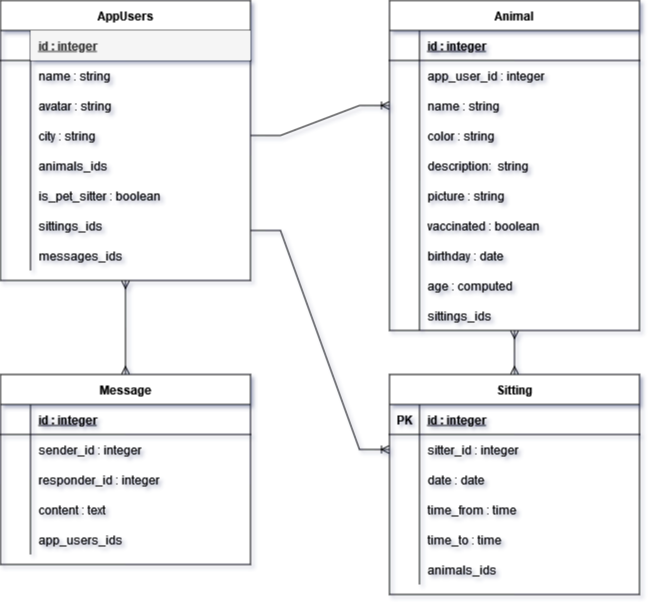
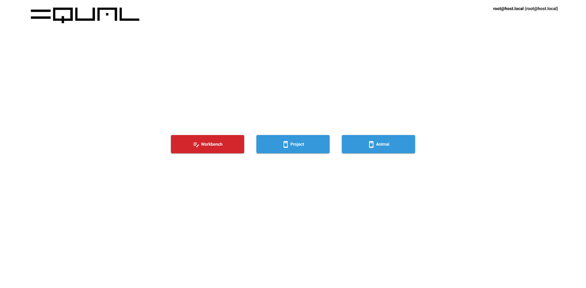
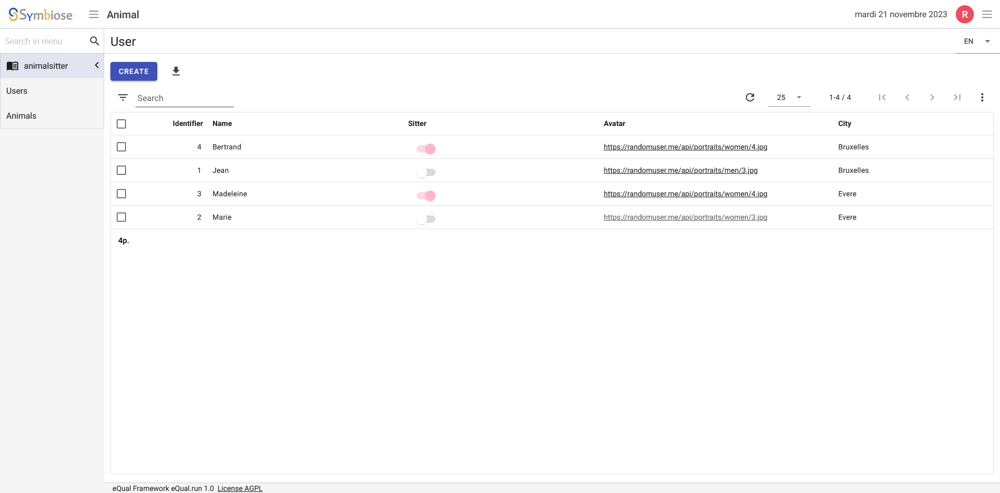
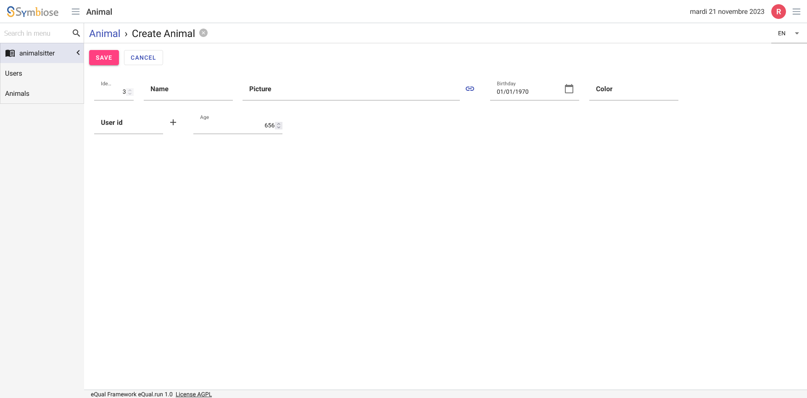

[](https://dl.circleci.com/status-badge/redirect/circleci/S4gF5Pqj58B3FRfUk8sp63/F7aVBC9PhP4Tzm8HSn877w/tree/main)
[](https://github.com/equalframework/equal)
[](https://github.com/swann-martin)


# eQual Framework and Animal Sitter Application Documentation :

Welcome to the documentation for the eQual Framework and the Animal Sitter application. This document will guide you through the setup and usage of the eQual Framework, as well as the specific features and components of the Animal Sitter application.

## About Animal Sitter
Animal Sitter is an application built on top of the eQual Framework. It is a simple application designed to help manage users, animals, and messages. This documentation will provide insights into the key aspects of the Animal Sitter application.

### Model Entity relational
<p width="100%" align="center">

</p>

### Prerequisite

Animal Sitter requires [eQual framework](https://github.com/equalframework/equal) to be installed on the system.

#### Install eQual framework :

The easiest way to install eQual is to use the [docker image](https://hub.docker.com/r/cedricfrancoys/equal/tags). It requires to have [docker](https://docs.docker.com/) installed and setup on your computer. You can then use the [docker compose file](https://raw.githubusercontent.com/equalframework/equal/master/.docker/docker-compose.yml) from github and follow the installation steps in the [equal documentation](https://doc.equal.run/getting-started/installation/).

To install eQual copy the docker-compose.yml file on you computer and run
```bash
docker compose up -d
```

Then Open VSCode and use the [Dev Container extension ](https://code.visualstudio.com/docs/devcontainers/containers) to navigate to the eQual framework container situated in /var/www/html.

```bash
cd /var/www/html
```

## I/ Initialising and configuring eQual

#### 1) Add config.json file in the config of the framework :
```json
/var/www/html/config/config.json
{
    "DB_DBMS": "MYSQL",
    "DB_HOST": "equal_db",
    "DB_PORT": "3306",
    "DB_USER": "root",
    "DB_PASSWORD": "test",
    "DB_NAME": "equal",
    "DEFAULT_RIGHTS": "QN_R_CREATE | QN_R_READ | QN_R_DELETE | QN_R_WRITE",
    "DEBUG_MODE": "QN_MODE_PHP | QN_MODE_ORM | QN_MODE_SQL",
    "DEBUG_LEVEL": "E_ALL | E_ALL",
    "DEFAULT_PACKAGE": "core",
    "AUTH_SECRET_KEY": "my_secret_key",
    "AUTH_ACCESS_TOKEN_VALIDITY": "5d",
    "AUTH_REFRESH_TOKEN_VALIDITY": "90d",
    "AUTH_TOKEN_HTTPS": false,
    "ROOT_APP_URL": "http://equal.local"
}

```

#### 2) Add composer.json file at the root of the framework :

```json
/var/www/html/composer.json
{
    "require": {
        "swiftmailer/swiftmailer": "^6.2",
        "phpoffice/phpspreadsheet": "^1.4",
        "dompdf/dompdf": "^0.8.3",
        "electrolinux/phpquery": "^0.9.6",
        "twig/twig": "^2.0",
        "twig/intl-extra": "^3.3",
        "endroid/qr-code": "^4.3",
        "codelicious/php-coda-parser": "^2.0"
    },
    "require-dev": {
        "phpunit/phpunit": "^9.5",
        "phpunit/php-code-coverage": "^9.2",
        "symplify/easy-coding-standard": "^11.1",
        "nikic/php-parser": "4.15.4"
    }
}
```

#### 3) Run the eQual command to init composer
```bash
./equal.run --do=init_composer
```

#### 4) Give ownership to www-data
````bash
cd /var/www/
chmod www-data:www-data html
````

# II/ The Animal Sitter Application
## 1) Clone the Animal Sitter Project

In Equal framework the apps are packages.
Go to `/var/www/html/packages` and run this command.
```bash
cd /var/www/html/packages
git clone https://github.com/swann-martin/animalsitter.git
```

## 2) Application structure

The application is organized into various components, which are stored within a package folder located under the `/packages` directory. In this example, the package is named `/animalsitter`.

Each package is structured as follows:
```
anmialsitter
├── classes
│   └── */*.class.php
├── data
│   └── *.php
├── init
│   └── data
│   	└── *.json
├── views
│   └── *.json
├── manifest.json
```

It corresponds to the MVC pattern. In an eQual package, the "classes" is the Model, "data" regroups the Controllers ad "views" are the views in json.
If you want to create a new project, you only need to create a new directory under packages and add classes, data, views and the manifest.json.

## 3) Initialize the package and Check its consistency :

Initialize the package animalsitter.

```shell
./equal.run --do=init_package --package=animalsitter
```
This will initialize the package animalsitter but also the package core since the manifest indicates that animalsitter depends on core.


```json
/packages/animalsitter/manifest.json
{
    ...
    "author": "YesBabylon",
    "license": "LGPL-3",
    "depends_on": [ "core" ],
    ...
}
```
To initialize the package AND import the initial data to populate the database with fake entities.
```shell
./equal.run --do=init_package --package=animalsitter --import=true
```

You can see the tables created in  `equal` data base. The names tables are `{{package_name}}_{{entity}}`
You can check that data was imported data by opening the tables `animalsitter_users` with your prefect DBMS.

Performs consistency checks between DB and class as well as syntax validation for classes (PHP), views and translation files (JSON). Typing this command.

```shell
./equal.run --do=test_package-consistency --package=animalsitter
```

## 4) Run the application :
Go to http://equal.local/apps/.
You will need to log in to be able to use the application.
 - You can use a default user from core package that was created on initialization. You can find the connection details in `/packages/core/init/data/core_User.json`.
 - You can also create a user.

```bash
./equal.run --do=model_create --entity=core\\User --fields[login]='project@example.com' --fields[password]='project1'
```
This will return some user's details. Copy the id for the next step.

The new user must be validated to gain access. To validate a user, use the following command. Make sure to have the user's ID:

```bash
./equal.run --do=model_update --entity='core\User' --ids=3 --fields='{validated:true}'
```
After completing these steps, in your navigator go to http://equal.local/apps/ and log in with your new user credentials, and click on the button "Animal".



### You will find the initial "fake" data

The format must respect a pattern. If the class is nest in a subdirectory and if the case is upper or lower. `init\data\{nameofthepackage}_{subdirectory}_{class}.json`

**Example of init data for an Animal instance**
```json
animalsitter_animal_Animal.json
[
  {
    "name": "animalsitter\\animal\\Animal",
    "lang": "en",
    "data": [
      {
        "id": 1,
        "name": "Poupinette",
        "color": "tiger",
        "birthday" : "10/05/2023",
        "description" : "Magnfique chat",
        "picture" : "https://images.unsplash.com/photo-1529778873920-4da4926a72c2?q=80&w=1936&auto=format&fit=crop&ixlib=rb-4.0.3&ixid=M3wxMjA3fDB8MHxwaG90by1wYWdlfHx8fGVufDB8fHx8fA%3D%3D",
        "user_id" : 1
      },
      {
        "id": 2,
        "name": "Gigot",
        "color": "white",
        "birthday": "07/12/22",
        "description" : "Superbe chien",
        "picture" : "https://images.unsplash.com/photo-1586671267731-da2cf3ceeb80?q=80&w=1978&auto=format&fit=crop&ixlib=rb-4.0.3&ixid=M3wxMjA3fDB8MHxwaG90by1wYWdlfHx8fGVufDB8fHx8fA%3D%3D",
        "user_id" : 3
      }
    ]
  }
]
```


## 5) Model definition

Each model is defined in a `.class.php` file located in the `/packages/animalsitter/classes` directory. All classes inherit from a common ancestor: the Model class, which is declared in the `equal\orm` namespace and defined in `/lib/equal/orm/Model.class.php`.

In this context, a class is always referred to as an entity and belongs to a specific package. Packages and their subdirectories are used as namespaces with the format `package_name`.

The standard filename format for these class files is: `{class_name}.class.php`.

### Example of a User.class.php

```php
<?php

namespace animalsitter;

use equal\orm\Model;

/**
 * @property string $name User name.
 * @property string $avatar User's picture.
 * @property string $city User city.
 * @property array $animals_ids
 * @property array $messages_ids
 * @property boolean $is_pet_sitter True if the user offers to babysit an animal.
 */
class User extends Model
{
    public static function getColumns()
    {
        return [
            'name' => [
                'usage' => '',
                'type' => 'string',
                'description' => 'User name.',
                'required' => true,
                'unique' => true,
            ],
            'avatar' => [
                'type' => 'string',
                'usage' => 'url',
                'description' => 'User\'s picture.',
                'default' => 'https://randomuser.me/api/portraits/lego/1.jpg',
            ],
            'city' => [
                'usage' => '',
                'type' => 'string',
                'description' => 'User city.',
            ],
            'animals_ids' => [
                'type' => 'one2many',
                'foreign_object' => 'animalsitter\\animal\\Animal',
                'foreign_field' => 'user_id',
                'sort' => 'asc',
            ],
            'messages_ids' => [
                'type' => 'one2many',
                'foreign_object' => 'animalsitter\\messages\\Message',
                'foreign_field' => 'user_id',
                'sort' => 'asc',
            ],
            'is_pet_sitter' => [
                'default' => false,
                'description' => 'True if the user offers to babysit an animal.',
                'type' => 'boolean'
            ],
        ];
    }
}
```

### User.class.php
-   The `name` field is mandatory and must be unique.
-   The `isactive` field is set to `true` by default.

Note that you can nest your classes in folders. If you want to group them.

## 6) Views

In eQual, views are in json.
For each entity, you should have two views : `list` and `form`. These views can be found in the `animalsitter/views`.

The standard filename format for these views is: `{class_name}.{view_type}.{view_name}.json`.
Pay attention !
The filename format should respect the case of the class. If you class is `User.class.php` your view should be something like `User.list.default.json` or  `User.form.default.json`.
It has to match the classes format so if you nested your files in subdirectories for these views is: `{directory}/{class_name}.{view_type}.{view_name}.json`.

For example `views/animal/Animal.list.default.json` will match the class `classes/animal/Animal.class.php`


**Example of a view**

<!--  -->


```json
User.list.default.json
{
    "name": "User",
    "description": "All information about users.",
    "domain": [],
    "limit": 25,
    "order": "name",
    "operations": {
      "total": {
        "id": {
          "usage": "numeric/integer",
          "operation": "COUNT",
          "suffix": "p."
        }
      }
    },
    "layout": {
      "items": [
        {
          "type": "field",
          "value": "id",
          "width": "10%"
        },
        {
          "type": "field",
          "value": "name",
          "label": "name",
          "width": "25%"
        },
        {
          "type": "field",
          "value": "is_pet_sitter",
          "label": "Sitter",
          "width": "25%"
        },
        {
          "type": "field",
          "value": "avatar",
          "label": "Avatar",
          "width": "30%"
        },
        {
          "type": "field",
          "value": "city",
          "width": "20%"
        }
      ]
    }
  }
```

**Example of form view**



```json
views/animal/Animal.form.default.json
{
    "name": "Animal",
    "description": "Simple form to create animals",
    "actions": [],
    "layout": {
        "groups": [
            {
                "id": "group.0",
                "sections": [
                    {
                        "id": "section.0",
                        "rows": [
                            {
                                "id": "row.0",
                                "columns": [
                                    {
                                        "id": "column.0",
                                        "width": "80%",
                                        "items": [
                                            {
                                                "type": "field",
                                                "value": "id",
                                                "width": "5%",
                                                "readonly": true
                                            },
                                          ...,
                                            {
                                                "type": "field",
                                                "value": "age",
                                                "width": "20%",
                                                "widget": {
                                                    "visible": ["birthday", ">", 0]
                                                }
                                            }
                                        ]
                                    }
                                ]
                            }
                        ]
                    }
                ]
            }
        ]
    }
}
```


Note that items can be widget and can have conditions to be visible or not.
Here age is only displayed if a "birthday" value has been entered.
```json
{
  "type": "field",
  "value": "age",
  "width": "20%",
  "widget": {
      "visible": ["birthday", ">", 0]
  }
}
```


## 7) Example of calculated fields in classes

Example of a calculated field. $age is a calculated field. This means that the user does not enter the value. It is calculated by eQual. Here we define a private method to return the animal's approximate age in months based on the field birthday. If the field value changes, the frontend sends an onchange event which will be .

```php

class Animal extends Model
{
    public static function getColumns()
    {
        return[
          //...
            'birthday' => [
                'type' => 'date',
                'usage' => 'date',
                'description' => 'Birthday of the animal if know.',
                'default' => '2023-01-01T03:15:00.000',
                'dependencies' => [
                    0 => 'age',
                ],
            ],
            'age' => [
                'type' => 'computed',
                'description' => 'Age of the animal in months if known.',
                'store' => true,
                'result_type' => 'integer',
                'function' => 'calcAge',
            ],
        ];
    }

    /**
     * Difference between $birthday and now
     * @param $birthday : date
     * returns the age of the animal in months
   */
    private static function computeAge($birthday)
    {
        return floor((time() - $birthday) / (86400 * 30));
    }

    /**
     * Compute the value of the calcAge of the animal from birthday.
     *
     * @param \equal\orm\Collection $self  An instance of a Animal collection.
     */
    public static function calcAge($self)
    {
        $result = [];
        $self->read(['birthday']);
        foreach ($self as $id => $animal) {
            $result[$id] = self::computeAge($animal['birthday']);
        }
        return $result;
    }

    /**
     * onchange $event checks if the entry birthday has changed and execute the method computeAge.
     * @param $event : Array
     * @param \equal\orm\Collection $self  An instance of a Animal collection.
     */
    public static function onchange($self, $event = [])
    {
        $result = [];
        if (isset($event['birthday'])) {
            $result['age'] = self::computeAge($event['birthday']);
        }
        return $result;
    }
}

```


## 8) Example of Controller

The controller returns $list

```php
<?php
use animalsitter\animal\Animal;

list($params, $providers) = eQual::announce([
    'description'   => 'Retrieve the list of existing animals',
    'params'        => [],
    'response'      => [
                        'content-type'  => 'application/json',
                        'charset'       => 'utf-8',
                        'accept-origin' => ['*']
                       ],
    'providers'     => ['context']
]);

list($context) = [ $providers['context'] ];

$list = Animal::search([])
        ->read(['id','name', 'age', 'description', 'user_id'])
        ->adapt('json')
        ->get(true);

$context->httpResponse()
        ->body($list)
        ->send();

```


## 8) Using Workbench tool to create easily components


Go to http://equal.local/workbench/

### Troubleshoot
If nothing is displayed you may be on an old version of eQual.
You can try to pull the most recent branch for development (dev-2.0 at the moment).

```bash
cd /var/wwww/html/core/
nano manifest.json

```

Check that "workbench" is in apps or add it.
```json
manifest.json
{
  // ...
  "apps": [ "apps", "auth", "app", "settings", "workbench" ],
}

```

#### Use console to connect

Go to http://equal.local/console.php.

If a message is displayed and says that the logs limit is reached, empty the log file.

```bash
cd /var/www/html/log
echo "" > eq_error.log
```

Check the rights are correctly set.

```bash
./equal.run --do=test_fs-consistency
```


Check the package consistency
```bash
./equal.run --do=test_package-consistency --package=animalsitter
```
